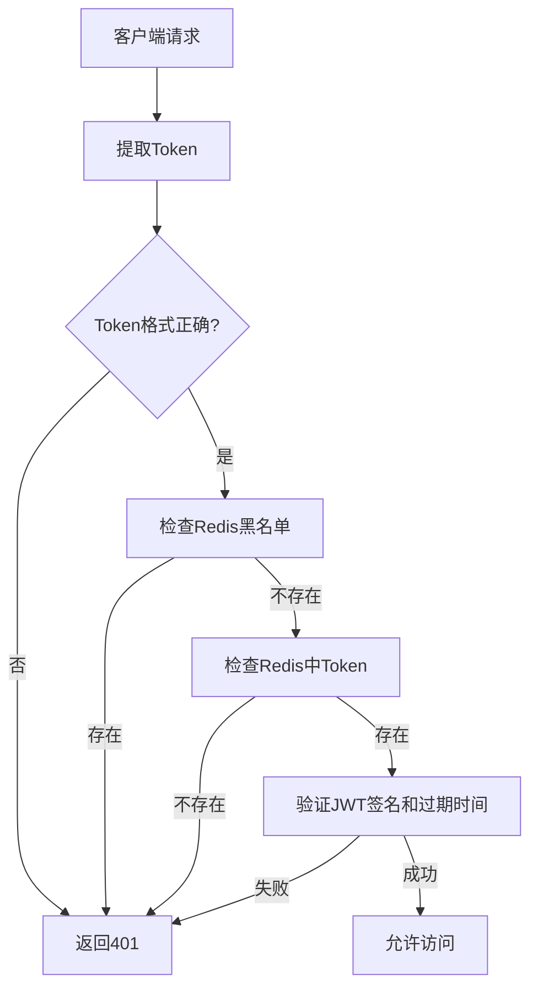

# Portal模块权限认证系统技术文档

## 概述

Portal模块使用JWT（JSON Web Token）和Redis相结合的方式实现用户认证和授权，确保系统的安全性和性能。

## 系统架构

### 核心组件

1. **AuthController** - 认证控制器，提供登录、注册、token验证等接口
2. **PortalJwtTokenUtil** - JWT工具类，负责token的生成和验证
3. **TokenServiceImpl** - Token服务实现，处理token的Redis存储和管理
4. **AuthService** - 认证业务服务，处理用户认证相关业务逻辑

### 技术栈

- **JWT**: 用于生成和验证访问令牌
- **Redis**: 用于token存储、黑名单管理和会话控制
- **Spring Security**: 提供认证和授权框架
- **MyBatis**: 数据访问层

## Token机制设计

### Token类型

1. **Access Token**
   - 用途：API访问凭证
   - 过期时间：24小时
   - 存储位置：Redis + JWT Claims
   - Redis键格式：`portal:access_token:{username}:{userId}`

2. **Refresh Token**
   - 用途：刷新访问令牌
   - 过期时间：7天
   - 存储位置：Redis
   - Redis键格式：`portal:refresh_token:{username}`

### Token验证流程



## API接口文档

### 认证相关接口

#### 1. 用户登录
- **接口**: `POST /api/auth/login`
- **功能**: 用户邮箱密码登录
- **请求参数**:
  ```json
  {
    "email": "user@example.com",
    "password": "password123"
  }
  ```
- **响应数据**:
  ```json
  {
    "code": 200,
    "message": "操作成功",
    "data": {
      "accessToken": "eyJhbGciOiJIUzUxMiJ9...",
      "refreshToken": "eyJhbGciOiJIUzUxMiJ9...",
      "tokenType": "Bearer",
      "expiresIn": "86400",
      "userInfo": {
        "id": 1,
        "username": "user123",
        "email": "user@example.com"
      }
    }
  }
  ```

#### 2. Token刷新
- **接口**: `POST /api/auth/refresh-token`
- **功能**: 使用refresh token获取新的access token
- **请求参数**: `refreshToken=eyJhbGciOiJIUzUxMiJ9...`
- **响应数据**:
  ```json
  {
    "code": 200,
    "message": "操作成功",
    "data": "eyJhbGciOiJIUzUxMiJ9..."
  }
  ```

#### 3. Token验证（网关接口）
- **接口**: `POST /api/auth/validate-token`
- **功能**: 网关调用接口，验证token有效性
- **请求参数**: `token=eyJhbGciOiJIUzUxMiJ9...`
- **响应数据**:
  ```json
  {
    "code": 200,
    "message": "Token验证成功",
    "data": {
      "username": "user123",
      "userId": 1,
      "userType": "member",
      "valid": true
    }
  }
  ```

#### 4. 强制用户下线
- **接口**: `POST /api/auth/force-logout`
- **功能**: 管理员接口，强制指定token的用户下线
- **请求参数**: `token=eyJhbGciOiJIUzUxMiJ9...`
- **响应数据**:
  ```json
  {
    "code": 200,
    "message": "操作成功",
    "data": "用户下线成功"
  }
  ```

#### 5. 用户注销
- **接口**: `POST /api/auth/logout`
- **功能**: 用户主动注销登录
- **请求头**: `Authorization: Bearer {token}`
- **响应数据**:
  ```json
  {
    "code": 200,
    "message": "操作成功",
    "data": "注销成功"
  }
  ```

## Redis存储策略

### 存储键设计

1. **Access Token存储**
   - 键名：`portal:access_token:{username}:{userId}`
   - 值：JWT token字符串
   - 过期时间：24小时

2. **Refresh Token存储**
   - 键名：`portal:refresh_token:{username}`
   - 值：Refresh token字符串
   - 过期时间：7天

3. **Token黑名单**
   - 键名：`portal:token_blacklist:{token}`
   - 值：`"revoked"`
   - 过期时间：24小时（与token剩余有效期一致）

### 存储优势

1. **性能优化**: Redis的高性能读写操作，避免频繁数据库查询
2. **会话控制**: 支持单点登录和强制下线功能
3. **安全性**: Token黑名单机制，支持立即失效
4. **一致性**: Token过期时间与Redis过期时间保持一致

## 安全特性

### 1. 双重验证机制
- JWT自身的签名验证
- Redis存储验证（防止token被盗用后无法控制）

### 2. Token黑名单
- 用户注销时立即将token加入黑名单
- 强制下线功能支持管理员操作
- 黑名单自动过期，避免Redis内存浪费

### 3. 防重放攻击
- 每次登录生成新的token对
- Refresh token使用后可以选择性更新

### 4. 会话管理
- 支持单用户多设备登录（如需要）
- 支持强制下线指定会话

## 配置说明

### JWT配置
```yaml
jwt:
  secret: your-jwt-secret-key
  expiration: 86400        # 24小时
  refresh-expiration: 604800  # 7天
  tokenHead: "Bearer "
```

### Redis配置
```yaml
spring:
  redis:
    host: localhost
    port: 6379
    password: your-redis-password
    database: 0
    timeout: 2000ms
    jedis:
      pool:
        max-active: 8
        max-wait: -1ms
        max-idle: 8
        min-idle: 0
```

## 错误代码

| 错误码 | 错误信息 | 说明 |
|--------|----------|------|
| 401 | Token验证失败 | token无效、过期或被注销 |
| 400 | Token不能为空 | 请求未携带token |
| 400 | 刷新Token无效或已过期 | refresh token无效 |
| 500 | Token验证异常 | 服务器内部错误 |

## 性能考量

### 1. Redis缓存策略
- 合理设置过期时间，避免内存泄漏
- 使用合适的数据结构，String类型适合token存储
- 批量操作时考虑pipeline优化

### 2. JWT负载优化
- Claims中只包含必要信息（用户ID、用户名、用户类型）
- 避免在JWT中存储敏感信息
- 控制token长度，避免过大

### 3. 并发处理
- Redis操作的原子性保证
- 避免token刷新时的竞态条件

## 监控和日志

### 日志记录
- 登录成功/失败记录
- Token验证失败记录
- 用户强制下线记录
- 异常情况记录

### 监控指标
- 活跃用户数（Redis key数量）
- Token验证成功率
- Refresh token使用频率
- 黑名单token数量

## 部署建议

1. **生产环境**:
   - 使用强密钥（至少32位）
   - 配置Redis集群保证高可用
   - 启用HTTPS传输加密

2. **开发环境**:
   - 可以设置较短的token过期时间便于测试
   - 启用详细日志输出

## 升级和维护

### 版本兼容性
- JWT secret变更时需要考虑现有token失效
- Redis键名格式变更需要数据迁移

### 定期维护
- 监控Redis内存使用情况
- 定期清理过期数据（Redis自动过期）
- 审计用户登录日志

## 扩展功能

### 可扩展特性
1. **多租户支持**: 在Redis键中增加租户标识
2. **设备管理**: 支持查看和管理用户登录设备
3. **登录限制**: IP白名单、地理位置限制
4. **审计追踪**: 详细的用户行为日志

---

**文档版本**: 1.0
**最后更新**: 2025-09-24
**维护人员**: 开发团队